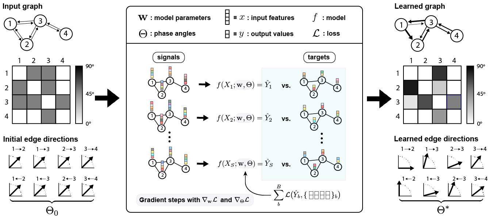

# Improving Graph Neural Networks by Learning Continuous Edge Directions



This repository contains the code required to reproduce the experimental results for CoED-GNN architecture described in the paper ["Improving Graph Neural Networks by Learning Continuous Edge Directions"](#).


## Overview

Graph Neural Networks (GNNs) traditionally employ a message-passing mechanism that resembles diffusion over undirected graphs, which often leads to homogenization of node features and reduced discriminative power. To address this issue, we assign **fuzzy edge directions**---that can vary continuously from node $i$ pointing to node $j$ to vice versa---to the edges of a graph so that features can preferentially flow in one direction between nodes to enable long-range information transmission across the graph. We also introduce a novel complex-valued Laplacian called **fuzzy Laplacian** for directed graphs with fuzzy edges where the real and imaginary parts represent information flow in opposite directions. Using this Laplacian, we propose a general framework, called **Continuous Edge Direction (CoED) GNN**, which aggregates neighbor features scaled by the edge directions and processes the aggregated messages from in-neighbors and out-neighbors separately alongside the self-features of the nodes, and prove its expressivity limits using a generalization of the Weisfeiler-Leman (WL) graph isomorphism test for directed graphs with fuzzy edges. Since continuous edge directions are differentiable, they can be learned jointly with the GNN weights from data during training. CoED GNN is particularly well-suited for **graph ensemble data** where the graph structure remains fixed but multiple realizations of node features are available (e.g., gene regulatory networks, web connectivity, power grids). We demonstrate through extensive experiments on both synthetic and real datasets that learning continuous edge directions significantly improves performance both for undirected and directed graphs compared with existing methods.   


## Getting Started

To get up and running with the project, first clone this repository.

```bash
git clone https://github.com/hormoz-lab/coed-gnn.git
```

We recommend setting up a [Conda](https://conda.io/projects/conda/en/latest/user-guide/install/index.html) enviornment to install the necessary dependencies. The project was developed using Python 3.11 on Linux. 

```bash
conda create -n coed_gnn python=3.11 scipy numpy
conda activate coed_gnn
```

### Installing Dependencies

Once the environment is activated, please install [PyTorch](https://pytorch.org) and [PyTorch Geometric (PyG)](https://pytorch-geometric.readthedocs.io/en/2.5.2/install/installation.html) compatible with your computing resources. Examples shown below are the version used for this project. 

```bash
pip install torch==2.2.2 torchvision==0.17.2 torchaudio==2.2.2 --index-url https://download.pytorch.org/whl/cu121
pip install torch_geometric
pip install pyg_lib torch_scatter torch_sparse torch_cluster torch_spline_conv -f https://data.pyg.org/whl/torch-2.2.2+cu121.html
```

The power grid dataset `OPFDataset` is only available from PyG version 2.6 or above. We instead provide the script to download and process the dataset in `opf.py` in `utils` directory. 

For the web traffic dataset, we used `WikiMath` dataset from [PyTorch Geometric Temporal](https://pytorch-geometric-temporal.readthedocs.io/en/latest/index.html) and performed a full batch training using [Jax](https://jax.readthedocs.io/en/latest/installation.html)/[Flax](https://flax.readthedocs.io/en/v0.5.3/installation.html)/[Optax](https://optax.readthedocs.io/en/latest/). Please refer to the [official installation guide](https://jax.readthedocs.io/en/latest/installation.html#pip-installation-nvidia-gpu-cuda-installed-via-pip-easier) to install the version compatible with your computing resources. Shown below are the version we used.

```bash
pip install jax==0.4.30 jaxlib==0.4.28+cuda12.cudnn89 
pip install flax==0.8.5 optax==0.1.7
pip install torch-geometric-temporal
```

### Repository Structure

The following codes represent the core functionality of this project.

* `src/`

    * `model.py`: Defines the CoED GNN architecture described the Paper.

    * `utils/fuzzy_laplacian.py`: Defines the function that computes the fuzzy Laplacian from given phase angles. 
      

* `experiments/`

    * `classification.py`: Runs node classification experiments on classical datasets.
    
    * `synthetic_ensemble.py`: Runs node regression experiments on two synthetic graph ensemble datasets.
    
    * `perturb_seq_ensemble.py`: Runs node regression experiment on perturb-seq dataset.
    
    * `web_traffic_ensemble.py`: Runs node regression experiment on WikiMath dataset.
    
    * `power_grid_ensemble.py`: Runs node regression experiment on AC-OPF dataset.
 
      
 
## Running Experiments

This section provides instructions on how to reproduce the experimental results in the paper. Note that some of the results may not be reproduced *exactly*, given that some of the operations used are intrinsically non-deterministic on the GPU, as explained [here](https://github.com/pyg-team/pytorch_geometric/issues/92). However, you should obtain results very close to those in the paper.

### Generating Synthetic Graph Ensemble

The jupyter notebook `experiments/synthetic_ensemble_generation.ipynb` walks you through how we generated the two synthetic graph ensemble datasets: directed flow on triangular lattice an gene regulatory network (GRN) dynamics. It also creates Figure 3 and Supplemental Figure C.1 (positional encoding) in the paper. 


### CoED GNN Experiments

First go to `experiments/` folder and follow the guidelines below for the respective results.

To reproduce the results of Table 1 in the paper, run the following command:

```bash
python classification.py --dataset {texas|wisconsin|squirrel|chameleon|cora} --use_best_hyperparams 
```

To reproduce the results of Table 2 in the paper, run the following command:

```bash
python synthetic_ensemble.py --dataset {lattice|grn} --use_best_hyperparams 
```

To reproduce the results of Table 3 in the paper, run the following command:

```bash
python {perturb_seq|web_traffic|power_grid}_ensemble.py --use_best_hyperparams 
```

## Command Line Arguments

The following command line arguments can be used with the code:

### Dataset Arguments

| Argument               | Type | Default Value | Description                   |
| ---------------------- | ---- | ------------- | ----------------------------- |
| --dataset              | str  | "chameleon"   | Name of the dataset           |
| --dataset-directory    | str  | "dataset"     | Directory to save datasets    |

### Preprocessing Arguments

| Argument                     | Action     | Description                          |
| ---------------------------- | ---------- | ----------------------------------   |
| --undirected                 | store_true | Use undirected version of graph      |
| --remove-existing-self-loop  | store_true | Remove existing self loos from graph |

### Model Arguments

| Argument                  | Type   | Default Value | Description                                       |
| ------------------------- | ------ | ------------- | ------------------------------------------------- |
| --model                   | str    | "CoED"        | Model type                                        |
| --hidden-dimension        | int    | 64            | Hidden dimension of model                         |
| --num-layers              | int    | 2             | Number of GNN layers                              |
| --dropout-rate            | float  | 0.0           | Feature dropout                                   |
| --alpha                   | float  | 0.5           | Direction convex combination params               |
| --normalize               | action | -             | If set, normalize feature at each layer           |
| --jumping-knowledge       | str    | "None"        | Type of jumping-knowledge mechanism               |
| --self-feature-transform  | action | -             | If set, transform self feature                    |
| --self-loop               | action | -             | If set, mix self feature to directional messsages |


### Training Args

| Argument               | Type   | Default Value | Description                                        |
| ---------------------- | ------ | ------------- | -------------------------------------------------- |
| --learning-rate        | float  | 0.001         | Learning rate                                      |
| --weight-decay         | float  | 0.0           | Weight decay                                       |
| --theta-learning-rate  | float  | 0.01          | Learning Rate for phase matrix $\Theta$            |
| --patience             | int    | 100           | Patience for early stopping                        |
| --store-theta          | action | -             | If set, save phase matrix $\Theta$ during training |
| --print-interval       | int    | 50            | Interval at which training progression is reported | 


### System Args

| Argument               | Type    | Default Value | Description                                         |
| ---------------------- | ------ | ------------- | ---------------------------------------------------- |
| --use-best-hyperparams | action | -             | If set, use previously found best hyperparameters    |
| --gpu-idx              | int    | 0             | Indexes of GPU to run program on                     |


### Datasets

All datasets can be loaded using `utils/data_loading.py`. Please be aware that downloading power grid dataset take a while. 
We provide pickle files for loading the two synthetic graph ensemble datasets and the perturb-seq dataset. The synthetic datasets were prepared as explained in [Generating Synthetic Graph Ensemble](#generating_synthetic_graph_ensemble). The perturb-seq dataset was processed following the steps detailed in Appendix A.3 of the paper using [Scanpy](https://scanpy.readthedocs.io/en/stable/). The processing script is available upon request.


## Credit
This repository builds on top of Emanuele Rossi's [dir-gnn repository](https://github.com/emalgorithm/directed-graph-neural-network). 


## Citation

```bibtex
# something
```


## Contact
If you have any questions, issues or feedback, feel free to open issue on this repo or reach out to Seong Ho Pahng at `spahng@g.harvard.edu`.
